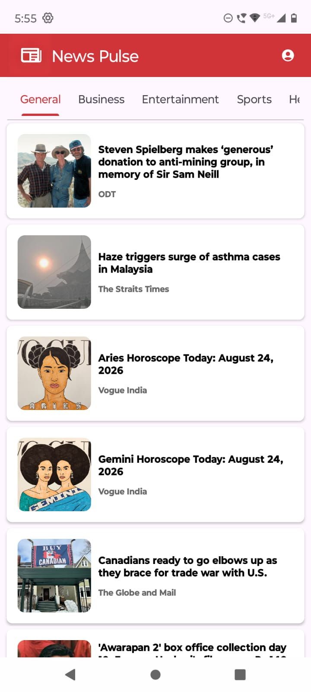
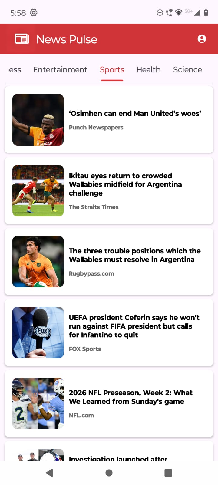

<h1> News Pulse📰 </h1> 
<h3>Overview : </h3>

 Java-based android news app with a simple user friendly interface that helps users stay updated with latest headlines from around the world 

<h3>Features: </h3>
<ul>
  <li>Display News in various categories</li>
  <li>Shows article titles, images, and descriptions</li>
  <li>Allows users to browse different news articles</li>
  <li>Simple and beginner-friendly user interface</li>
</ul>

<h3>Screenshots: </h3>
<table align="center">
        <tr>
            <td></td>
            <td></td>
        </tr>
        <tr>
            <td></td>
            <td></td>
        </tr>
        <tr>
            <td></td>
            <td></td>
        </tr>
        <tr>
            <td></td>
            <td></td>
        </tr>
</table>
